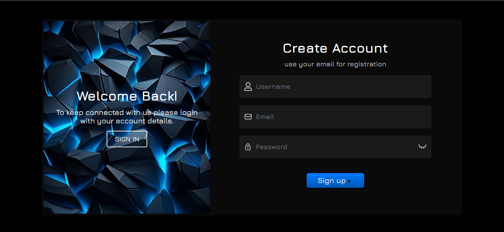
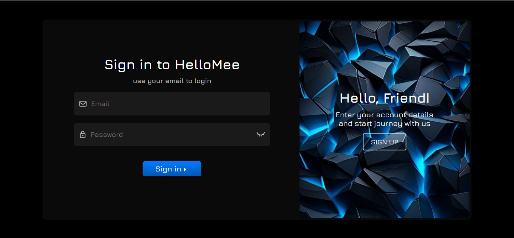
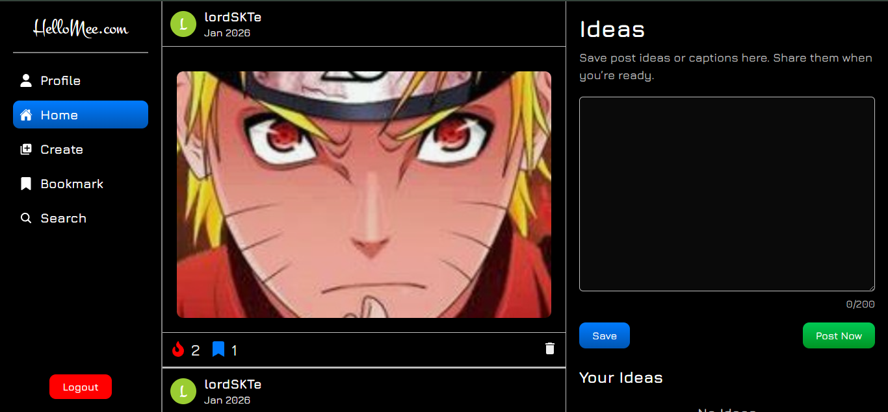
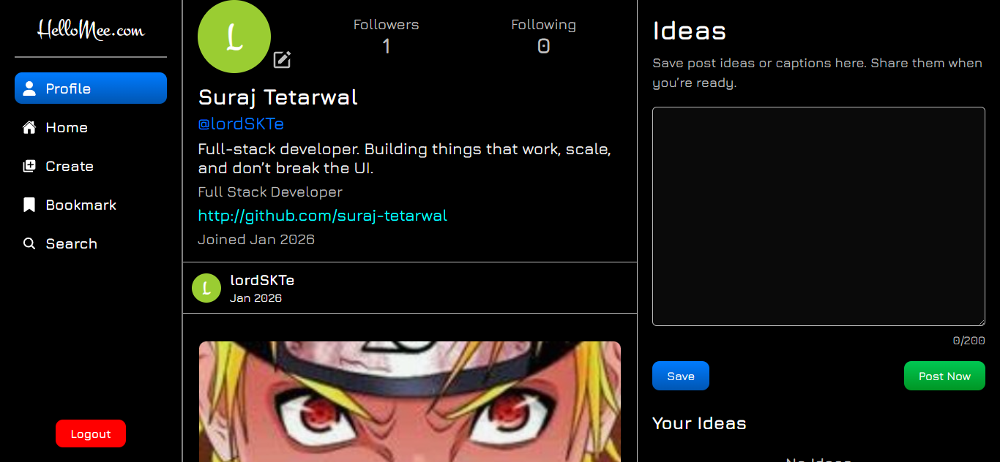
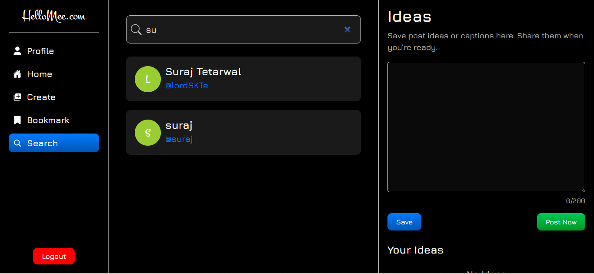

# HelloMee

HelloMee is a full-stack social media web application where users can create posts, interact with other users, and manage their profile.  
The platform provides common social media features like posting, liking, bookmarking, following users, and searching profiles.

A full-stack social media application built with **React**, **Node.js**, **Express**, and **SQLite** where users can create posts, interact with others, and manage their social activity.

- Deployed Link: https://hello-mee-v1.vercel.app/sign-in

## Tech Stack

Frontend
- React.js
- JavaScript
- HTML
- CSS

Backend
- Node.js
- Express.js

Database
- SQLite

Tools
- REST APIs
- Postman

---

## Features

### User Features
- User registration and login
- User profile management
- Follow / Unfollow users
- Search users

### Post Features
- Create post
- Edit post
- Delete post
- Save post as draft
- Publish post

### Interaction Features
- Like posts
- Bookmark posts
- View posts from followed users

---

## Screenshots

### Create Account Page


### Login Page


### Home Page


### Bookmark Page


### User Profile


### Search User


---

## Setup Instructions

### Clone the repository

```
git clone https://github.com/suraj-tetarwal/HelloMee.git
```

### Backend Setup

```
cd backend
npm install
node server.js
```

### Frontend Setup

```
cd frontend
npm install
npm start
```

## Author

Suraj Tetarwal

Full Stack/Backend Developer
